# Домашнее задание к занятию 5 «Практическое применение Docker»

Краснов Егор

## Описание

В рамках домашнего задания был выполнен fork репозитория `shvirtd-example-python`, подготовлена multistage-сборка Python-приложения, настроен запуск проекта через Docker Compose с подключением `proxy.yaml`, выполнен запуск на виртуальной машине в Yandex Cloud, а также выполнено извлечение бинарного файла Terraform из Docker-образа разными способами.

Ссылка на fork-репозиторий:

```text
https://github.com/sarkroge/shvirtd-example-python
```

---

## Задача 0

Проверено, что старая команда `docker-compose` с тире не установлена, а актуальная команда `docker compose` работает.

Выполненные команды:

```bash
docker --version
docker compose version
docker-compose --version
```

Результат:

```text
Docker version 29.4.2
Docker Compose version v5.1.3
Command 'docker-compose' not found
```

Скриншот:

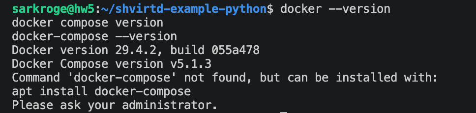

---

## Задача 1

Был выполнен fork репозитория:

```text
https://github.com/netology-code/shvirtd-example-python
```

В fork-репозиторий были добавлены файлы:

```text
Dockerfile.python
.dockerignore
.gitignore
```

### Dockerfile.python

Для сборки Python-приложения был создан multistage `Dockerfile.python` на базе образа `python:3.12-slim`.

```dockerfile
FROM python:3.12-slim AS builder

WORKDIR /app

ENV PYTHONDONTWRITEBYTECODE=1
ENV PYTHONUNBUFFERED=1
ENV PIP_NO_CACHE_DIR=1

RUN python -m venv /opt/venv
ENV PATH="/opt/venv/bin:$PATH"

COPY requirements.txt .
RUN pip install --upgrade pip && pip install -r requirements.txt


FROM python:3.12-slim AS runtime

WORKDIR /app

ENV PYTHONDONTWRITEBYTECODE=1
ENV PYTHONUNBUFFERED=1
ENV PATH="/opt/venv/bin:$PATH"

COPY --from=builder /opt/venv /opt/venv

COPY . .

EXPOSE 5000

CMD ["uvicorn", "main:app", "--host", "0.0.0.0", "--port", "5000"]
```

### Проверка сборки

Выполнена команда:

```bash
docker build -f Dockerfile.python -t shvirtd-python:local .
docker images | grep shvirtd-python
```

Сборка завершилась успешно, образ был создан.

Скриншот:

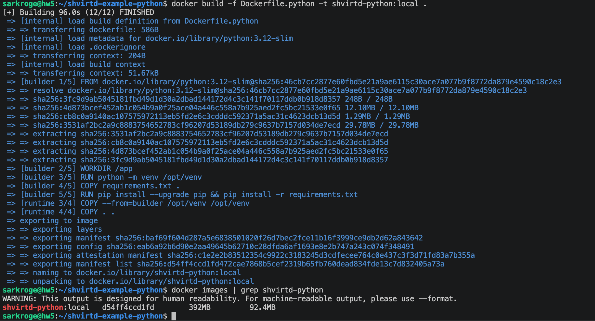

---

## Задача 3

В корне проекта был создан файл `compose.yaml`. В него через директиву `include` был подключён файл `proxy.yaml`.

В `compose.yaml` были описаны сервисы:

- `web` — Python/FastAPI-приложение;
- `db` — MySQL 8;
- также используются прокси-сервисы из `proxy.yaml`.

### compose.yaml

```yaml
include:
  - proxy.yaml

services:
  web:
    build:
      context: .
      dockerfile: Dockerfile.python
    container_name: web
    restart: always
    depends_on:
      db:
        condition: service_healthy
    environment:
      DB_HOST: db
      DB_USER: ${MYSQL_USER}
      DB_PASSWORD: ${MYSQL_PASSWORD}
      DB_NAME: ${MYSQL_DATABASE}
    networks:
      backend:
        ipv4_address: 172.20.0.5

  db:
    image: mysql:8
    container_name: db
    restart: always
    env_file:
      - .env
    environment:
      MYSQL_ROOT_PASSWORD: ${MYSQL_ROOT_PASSWORD}
      MYSQL_DATABASE: ${MYSQL_DATABASE}
      MYSQL_USER: ${MYSQL_USER}
      MYSQL_PASSWORD: ${MYSQL_PASSWORD}
    volumes:
      - mysql_data:/var/lib/mysql
    networks:
      backend:
        ipv4_address: 172.20.0.10
    healthcheck:
      test: ["CMD-SHELL", "mysqladmin ping -h 127.0.0.1 -uroot -p$${MYSQL_ROOT_PASSWORD} --silent"]
      interval: 10s
      timeout: 5s
      retries: 10
      start_period: 30s

volumes:
  mysql_data:
```

### Запуск проекта

Выполнены команды:

```bash
docker compose up -d --build
docker compose ps
```

Скриншот:

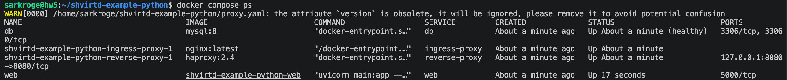

### Проверка HTTP-запроса

Выполнена команда:

```bash
curl -L http://127.0.0.1:8090
```

Приложение вернуло время и IP-адрес.

Скриншот:

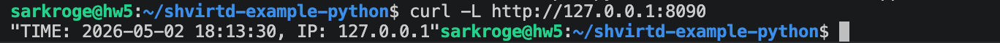

### Проверка записи в MySQL

После первого HTTP-запроса была проверена запись в базе данных.

Подключение к MySQL:

```bash
docker exec -ti db mysql -uroot -p<MYSQL_ROOT_PASSWORD>
```

SQL-запросы:

```sql
show databases;
use virtd;
show tables;
SELECT * from requests LIMIT 10;
```

Скриншот:

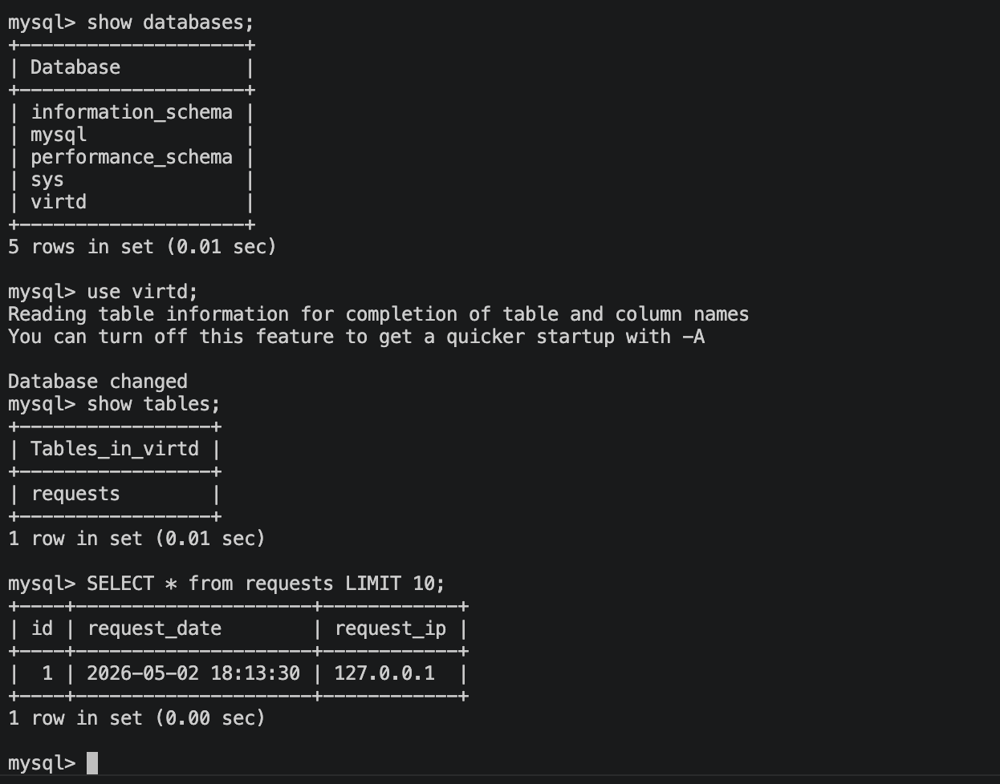

---

## Задача 4

В Yandex Cloud была создана виртуальная машина с Ubuntu. На ВМ был установлен Docker, после чего проект был развёрнут из fork-репозитория.

Для автоматизации деплоя был создан bash-скрипт `deploy.sh`.

### deploy.sh

```bash
#!/usr/bin/env bash
set -Eeuo pipefail

REPO_URL="https://github.com/sarkroge/shvirtd-example-python.git"
APP_DIR="/opt/shvirtd-example-python"

echo "[1/7] Installing packages"
sudo apt-get update
sudo apt-get install -y ca-certificates curl gnupg git

echo "[2/7] Installing Docker if needed"
if ! command -v docker >/dev/null 2>&1; then
  sudo install -m 0755 -d /etc/apt/keyrings
  curl -fsSL https://download.docker.com/linux/ubuntu/gpg | sudo tee /etc/apt/keyrings/docker.asc >/dev/null
  sudo chmod a+r /etc/apt/keyrings/docker.asc

  echo \
    "deb [arch=$(dpkg --print-architecture) signed-by=/etc/apt/keyrings/docker.asc] https://download.docker.com/linux/ubuntu \
    $(. /etc/os-release && echo "$VERSION_CODENAME") stable" | \
    sudo tee /etc/apt/sources.list.d/docker.list >/dev/null

  sudo apt-get update
  sudo apt-get install -y docker-ce docker-ce-cli containerd.io docker-buildx-plugin docker-compose-plugin
fi

echo "[3/7] Enabling Docker"
sudo systemctl enable --now docker

echo "[4/7] Preparing /opt"
sudo mkdir -p /opt
sudo chown "$USER:$USER" /opt

echo "[5/7] Cloning or updating repo"
if [ -d "$APP_DIR/.git" ]; then
  git -C "$APP_DIR" fetch --all
  git -C "$APP_DIR" reset --hard origin/main
else
  git clone "$REPO_URL" "$APP_DIR"
fi

echo "[6/7] Starting project"
cd "$APP_DIR"
docker compose down || true
docker compose up -d --build

echo "[7/7] Status"
docker compose ps

echo "Local check:"
curl -L http://127.0.0.1:8090 || true
```

### Запуск на ВМ

Выполнены команды:

```bash
cd /tmp
git clone https://github.com/sarkroge/shvirtd-example-python.git
cd shvirtd-example-python
chmod +x deploy.sh
./deploy.sh
```

После запуска были проверены контейнеры:

```bash
docker compose ps
```

Скриншот:

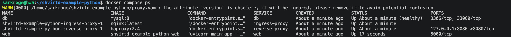

### Проверка HTTP-доступности

Локальная проверка на ВМ:

```bash
curl -L http://127.0.0.1:8090
```

Внешняя проверка выполнялась через сервис проверки HTTP-доступности:

```text
http://<PUBLIC_VM_IP>:8090
```

Скриншот:

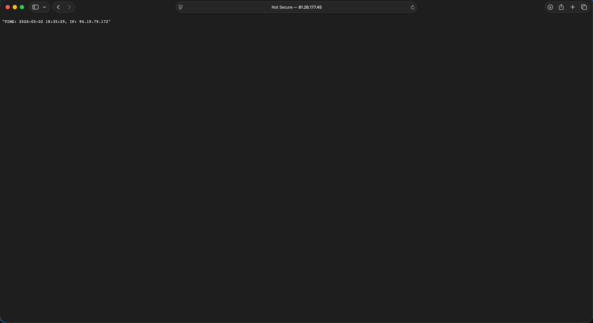

### SQL-проверка на ВМ

Выполнено подключение к контейнеру MySQL:

```bash
docker exec -ti db mysql -uroot -p<MYSQL_ROOT_PASSWORD>
```

SQL-запросы:

```sql
show databases;
use virtd;
show tables;
SELECT * from requests LIMIT 10;
```

Скриншот:

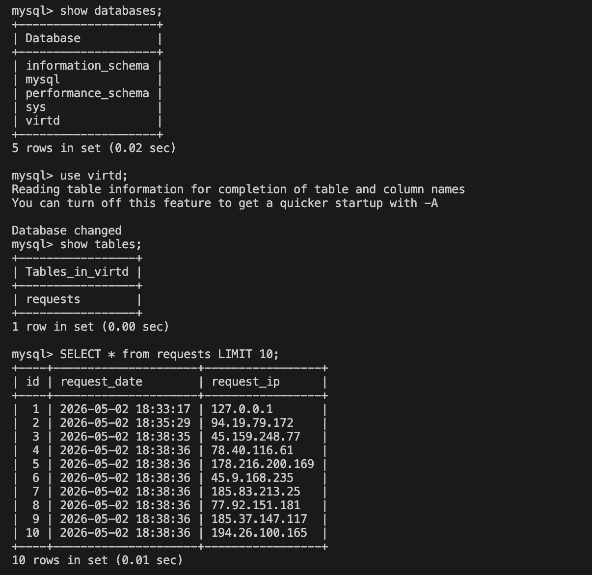

---

## Задача 6

Был скачан Docker-образ `hashicorp/terraform:latest`, после чего образ был сохранён в архив с помощью `docker save`.

Выполненные команды:

```bash
docker pull hashicorp/terraform:latest
docker save hashicorp/terraform:latest -o terraform.tar
ls -lh terraform.tar
```

После этого образ был открыт через `dive`:

```bash
dive docker-archive://terraform.tar
```

В `dive` был найден бинарный файл:

```text
/bin/terraform
```

Скриншот:

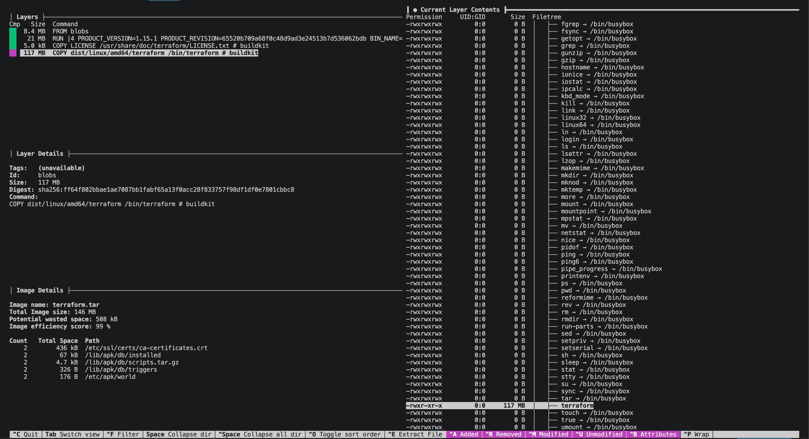

### Извлечение файла из docker save

Архив был распакован, найден слой с бинарным файлом Terraform и выполнена проверка версии.

Пример команд:

```bash
mkdir -p ~/terraform-from-save
tar -xf terraform.tar -C ~/terraform-from-save

FOUND_LAYER=$(find ~/terraform-from-save -type f | while read f; do
  tar -tf "$f" 2>/dev/null | grep -q "bin/terraform" && echo "$f" && break
done)

echo "$FOUND_LAYER"

mkdir -p ~/terraform-extracted
tar -xf "$FOUND_LAYER" -C ~/terraform-extracted bin/terraform

chmod +x ~/terraform-extracted/bin/terraform
~/terraform-extracted/bin/terraform version
```

Скриншот:

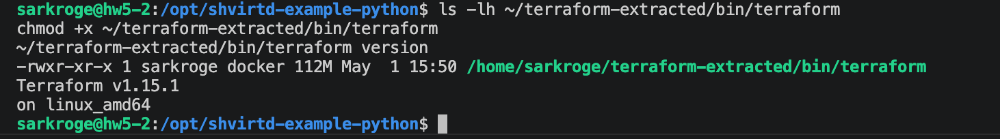

---

## Задача 6.1

Был выполнен аналогичный результат через `docker cp`.

Выполненные команды:

```bash
docker create --name terraform-copy hashicorp/terraform:latest
docker cp terraform-copy:/bin/terraform ./terraform
chmod +x ./terraform
./terraform version
docker rm terraform-copy
```

Результат: бинарный файл Terraform был скопирован из контейнера на локальную машину и успешно запущен.

Скриншот:

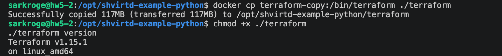

---

## Задача 6.2

Был предложен способ извлечения файла из контейнера только с помощью `docker build` и Dockerfile.

Создан Dockerfile:

```dockerfile
FROM hashicorp/terraform:latest AS source

FROM scratch
COPY --from=source /bin/terraform /terraform
```

Сборка с экспортом результата наружу:

```bash
docker build --output type=local,dest=./out .
```

Проверка результата:

```bash
ls -lh ./out
chmod +x ./out/terraform
./out/terraform version
```

Результат: файл Terraform был извлечён в директорию `./out` и успешно запущен.

Скриншот:

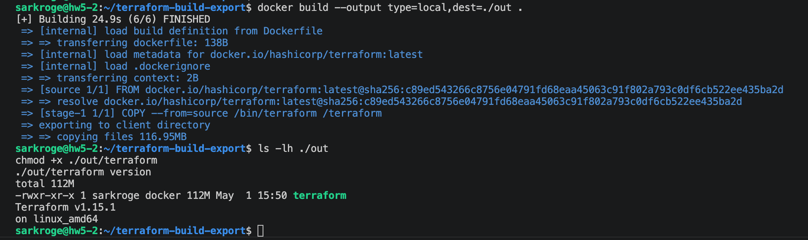

---

## Итог

В ходе выполнения домашнего задания были выполнены следующие действия:

1. Проверено отсутствие старого `docker-compose` и наличие актуального `docker compose`.
2. Создан fork исходного репозитория.
3. Добавлен multistage `Dockerfile.python` для Python-приложения.
4. Добавлены `.dockerignore` и `.gitignore`.
5. Создан `compose.yaml` с подключением `proxy.yaml`.
6. Запущены сервисы `web`, `db`, Nginx и HAProxy.
7. Проверена работа приложения через порт `8090`.
8. Проверена запись запросов в MySQL.
9. Проект развёрнут на ВМ в Yandex Cloud через `deploy.sh`.
10. Выполнено извлечение бинарного файла Terraform тремя способами:
    - через `docker save` и `dive`;
    - через `docker cp`;
    - через `docker build --output`.
